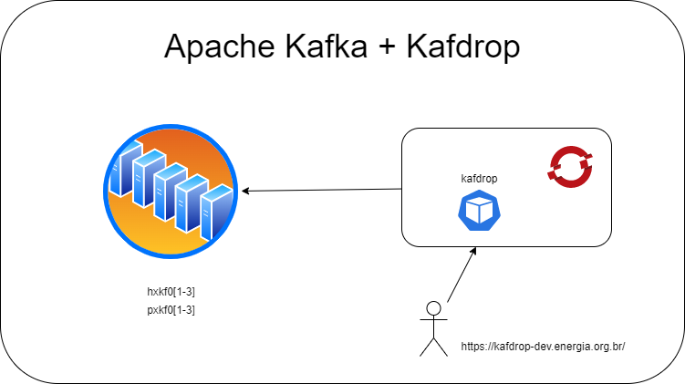

## kafka

[ansible-role-kafka](https://github.com/sleighzy/ansible-kafka)

## Requerimento
```
Regra 1:

Liberar as seguintes regra de firewall:
Essas regras são necessárias para efetuarmos o download das aplicações.

Origem:
pxkf01, pxkf02, pxkf03
Destino (Ansible-role).

https://downloads.apache.org

https://downloads.apache.org/kafka

https://www-eu.apache.org/dist/zookeeper

Regra 2:

Portas de comunicação entre servidores/serviços
Origem e destino eles devem se comunicar entre eles nessas portas.
pxkf01, pxkf02, pxkf03

9092 TCP/UDP
9093 TCP/UDP
9094 TCP/UDP
2181 TCP/UDP
2888 TCP/UDP
3888 TCP/UDP
8080 TCP/UDP
7000 TCP/UDP

```


## How to


A partir do servidor `ansible` o projeto deve ser clonado para a instalação das roles/apps

```
cd /opt/automacao/observability/data-analytics
alias git='sudo git' #optional

git  clone https://github.com/florentinolim/installkafka.git
git checkout <BRANCH>

sudo ansible-galaxy install --force --roles-path=$(pwd) --role-file requirements.yml
sudo ansible-playbook ${ANSIBLE_SSH_KEY} --inventory environments/<ENV>/hosts playbook.yml --user ansible
```




A ansible role faz a instação e tunning de vários componentes como:
- Zookeeper
- Java

## Referências

- https://github.com/sleighzy/ansible-kafka

